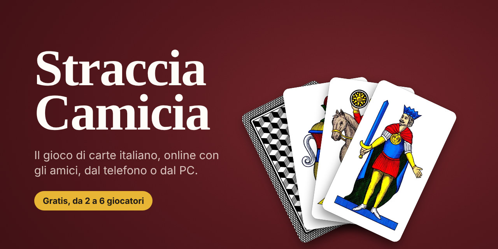
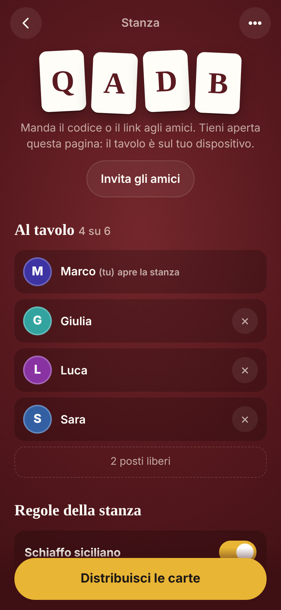
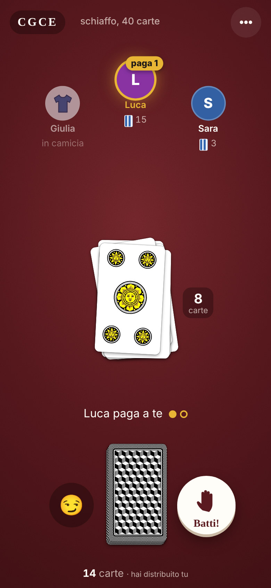
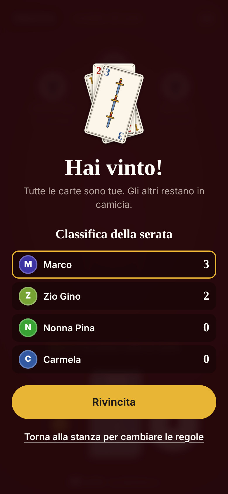
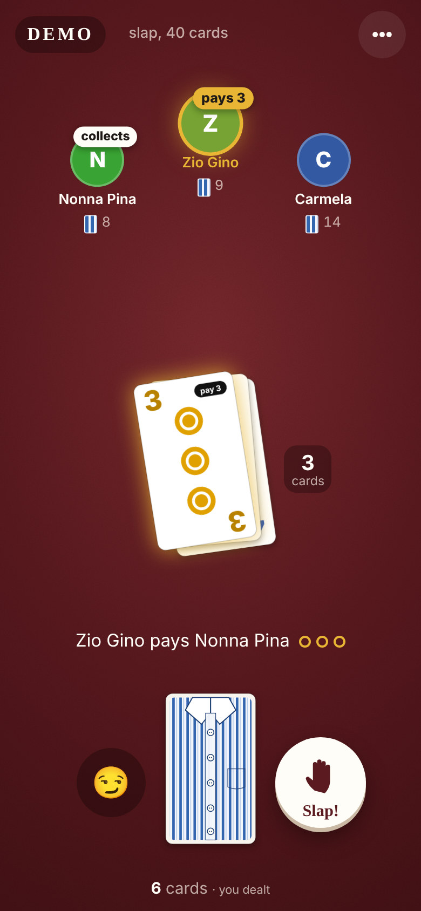

<p align="center">
  
</p>

<p align="center">
  <b>Il gioco di carte italiano, online con gli amici.</b><br>
  Ognuno dal suo telefono o PC, da 2 a 6 giocatori. Gratis, senza registrazione, senza server.
</p>

<p align="center">
  <a href="https://developermatt02.github.io/straccia-camicia-p2p/"><b>Gioca ora</b></a>
  &nbsp;&nbsp;|&nbsp;&nbsp;
  <a href="README.en.md">English version</a>
</p>

---

<table align="center">
  <tr>
    <td align="center"></td>
    <td align="center"></td>
    <td align="center"></td>
    <td align="center"></td>
  </tr>
  <tr>
    <td align="center"><sub>Crei la stanza e mandi il codice</sub></td>
    <td align="center"><sub>Asso, due e tre fanno pagare</sub></td>
    <td align="center"><sub>Classifica e rivincita</sub></td>
    <td align="center"><sub>Anche in inglese, con le piacentine</sub></td>
  </tr>
</table>

## Cos'è

Straccia Camicia (o scamicia, cavacamisa, tras in camisa, pela gallina, a seconda di dove sei cresciuto) è il gioco di carte con cui tanti hanno imparato a usare il mazzo italiano. Questa è una versione per giocarci a distanza: uno crea una stanza, manda il link al gruppo, e ognuno gira le sue carte dal proprio telefono.

- **Online tra amici**: stanza con codice di 4 lettere o link da condividere, da 2 a 6 giocatori.
- **Gira su tutto**: telefono, tablet e PC, direttamente dal browser. Si può aggiungere alla schermata Home come un'app.
- **Gratis davvero**: è un sito statico su GitHub Pages; i dispositivi si parlano direttamente tra loro, quindi non c'è nessun server da pagare.
- **Tutte le regole**, più le varianti regionali da scegliere per ogni stanza.
- **Carte vere**: napoletane e piacentine dalle scansioni di mazzi reali, più uno stile moderno con i numeri grandi, comodo sul telefono. Ognuno sceglie il suo alla prima apertura e lo cambia quando vuole, anche a partita in corso.
- **Avatar**: l'iniziale del nome, un disegno fatto apposta (moka, cornetto, Vesuvio, i quattro semi…) o un'emoji. Nome, mazzo e avatar restano salvati nel browser.
- **Italiano e inglese**: ognuno sceglie la sua lingua, anche nella stessa partita.
- **Sfottò, suoni e vibrazione**, classifica della serata e rivincita al volo.
- **Prova contro il computer** per imparare le regole da soli, anche senza internet.

## Le regole

Si gioca con il mazzo italiano da 40 carte. Le carte vengono divise coperte e nessuno guarda il proprio mazzetto.

1. A turno ognuno gira la prima carta del suo mazzetto al centro del tavolo.
2. Asso, due e tre fanno pagare: il giocatore successivo deve girare 1, 2 o 3 carte.
3. Se mentre paghi esce un asso, un due o un tre, smetti di pagare e tocca al prossimo pagare a te.
4. Se finisci di pagare senza carte buone, chi ha giocato l'ultima carta pagante prende tutto il mazzetto, lo mette sotto le sue carte e riparte.
5. Chi deve giocare e non ha più carte resta in camicia. Vince chi si prende tutte le carte.

Dettagli che il gioco rispetta: il mazzo viene tagliato prima di distribuire, le carte avanzate vanno ai primi giocatori dopo il mazziere, il mazziere cambia a ogni partita, e se chi paga finisce le carte il mazzetto va comunque a chi riscuote.

### Varianti per la stanza

Chi crea la stanza le sceglie prima di distribuire:

| Variante | Come funziona |
| --- | --- |
| Schiaffo siciliano | Due carte dello stesso valore una sopra l'altra: chi batte per primo prende il mazzetto. Chi batte a vuoto paga una carta. |
| Ritmo | Libero, 6 secondi, oppure calabrese (2,5 secondi): allo scadere la carta parte da sola. |
| Mazzi | 1, 2 o 3 mazzi uniti (40, 80, 120 carte), come nella Super Camicia valtellinese. |
| Penitenza | Alla veneta: a fine partita chi perde vede la sua camicia stracciata. |

Lo schiaffo è giusto anche con connessioni diverse: vince chi ha il riflesso più rapido misurato sul proprio dispositivo, non chi ha la rete più veloce.

### La partita infinita

Esiste una disposizione delle carte con cui la partita non finisce mai: è stata trovata nel 2017 ed era un problema aperto della matematica dei giochi. Se capita, il gioco se ne accorge e dichiara la patta.

## Come giocare online

1. Apri il sito, scrivi il tuo nome e tocca **Crea una stanza**.
2. Con **Invita gli amici** manda il link nel gruppo, oppure detta il codice.
3. Quando ci siete tutti, scegli le regole e tocca **Distribuisci le carte**.

Comandi: tocca il tuo mazzetto per girare la carta, il pulsante con la mano per lo schiaffo. Sul computer funzionano anche Spazio e B.

Da sapere:

- **Il tavolo vive sul dispositivo di chi crea la stanza**, che deve tenere la pagina aperta. Se la chiude, la stanza si chiude per tutti.
- Se qualcun altro perde la connessione, le sue carte continuano a giocare da sole. Riaprendo lo stesso link rientra al suo posto.
- Chi entra a partita iniziata guarda e gioca dalla partita successiva.

## Se qualcuno non riesce a entrare

I dispositivi provano prima a collegarsi direttamente. Molte reti però lo bloccano: quasi tutte le reti mobili 4G/5G italiane (sono dietro un NAT condiviso) e alcuni Wi-Fi universitari o aziendali. Se entrambi siete su rete mobile, di solito serve un server TURN, un "ponte" che fa passare i dati quando il collegamento diretto non riesce.

Per attivarlo gratis con [Open Relay di Metered](https://www.metered.ca/tools/openrelay/) (20 GB al mese, molto più di quanto serve: una partita scambia pochi kilobyte):

1. Crea un account gratuito su [metered.ca](https://www.metered.ca/tools/openrelay/).
2. Nella dashboard, nella sezione del server TURN, copia l'indirizzo per le credenziali, del tipo `https://NOMEAPP.metered.live/api/v1/turn/credentials?apiKey=…`.
3. Incollalo in [`js/config.js`](js/config.js) nella riga `TURN_CREDENTIALS_URL`, salva e pubblica.

La chiave finisce nel sito pubblico: al massimo qualcuno potrebbe consumare i tuoi 20 GB gratuiti. Se il servizio non risponde, il gioco prova comunque il collegamento diretto.

## Com'è fatto

JavaScript puro, senza framework né passaggi di build. Napoletane e piacentine sono immagini WebP leggere (circa 30 KB a carta) in [`carte/`](carte); lo stile moderno è disegnato in SVG e i suoni sono sintetizzati al volo.

| File | Cosa contiene |
| --- | --- |
| [`js/engine.js`](js/engine.js) | Le regole del gioco, senza grafica |
| [`js/room.js`](js/room.js) | La stanza: turni, timer, schiaffi, classifica (gira su chi crea la stanza) |
| [`js/net.js`](js/net.js) | Il collegamento tra i dispositivi con [PeerJS](https://peerjs.com) (WebRTC) |
| [`js/cards.js`](js/cards.js) | Le carte nei tre stili: immagini vere e carte moderne in SVG |
| [`js/avatars.js`](js/avatars.js) | Gli avatar: disegni in SVG ed emoji |
| [`js/i18n.js`](js/i18n.js) | I testi in italiano e inglese |
| [`js/main.js`](js/main.js) | L'interfaccia |
| [`js/audio.js`](js/audio.js) | Suoni e vibrazione |

Chi crea la stanza fa da arbitro: tiene lo stato della partita e manda agli altri solo quello che possono vedere, quindi nessuno può sbirciare le carte coperte.

### Test

```sh
npm test                          # regole e stanza (serve solo Node.js)
python3 -m http.server 8765 &     # poi, in un altro terminale:
python3 tests/e2e_multi.py        # partita a 3 dispositivi nel browser (serve Playwright)
```

I test delle regole giocano 2000 partite casuali con 2–6 giocatori e 1–3 mazzi controllando che non si perda nessuna carta, e verificano che la partita infinita del 2017 venga riconosciuta. Il test nel browser simula tre telefoni (anche in lingue diverse) che entrano nella stessa stanza, giocano, si mandano sfottò, si schiaffano, si disconnettono e rientrano, anche quando cade il server di presentazione di PeerJS.

## Crediti

- Regole e varianti dalla voce [Straccia camicia](https://it.wikipedia.org/wiki/Straccia_camicia) di Wikipedia.
- La partita infinita è quella trovata con [drago-96/cavacamisa](https://github.com/drago-96/cavacamisa).
- Carte napoletane: scansioni di un mazzo Dal Negro di Trocche100; carte piacentine: scansione di Florixc. Entrambe da Wikimedia Commons, di pubblico dominio. Dettagli in [`carte/CREDITI.md`](carte/CREDITI.md).
- Collegamento peer-to-peer con [PeerJS](https://github.com/peers/peerjs) (licenza MIT).

## Licenza

[MIT](LICENSE): puoi usarlo, modificarlo e condividerlo liberamente.
